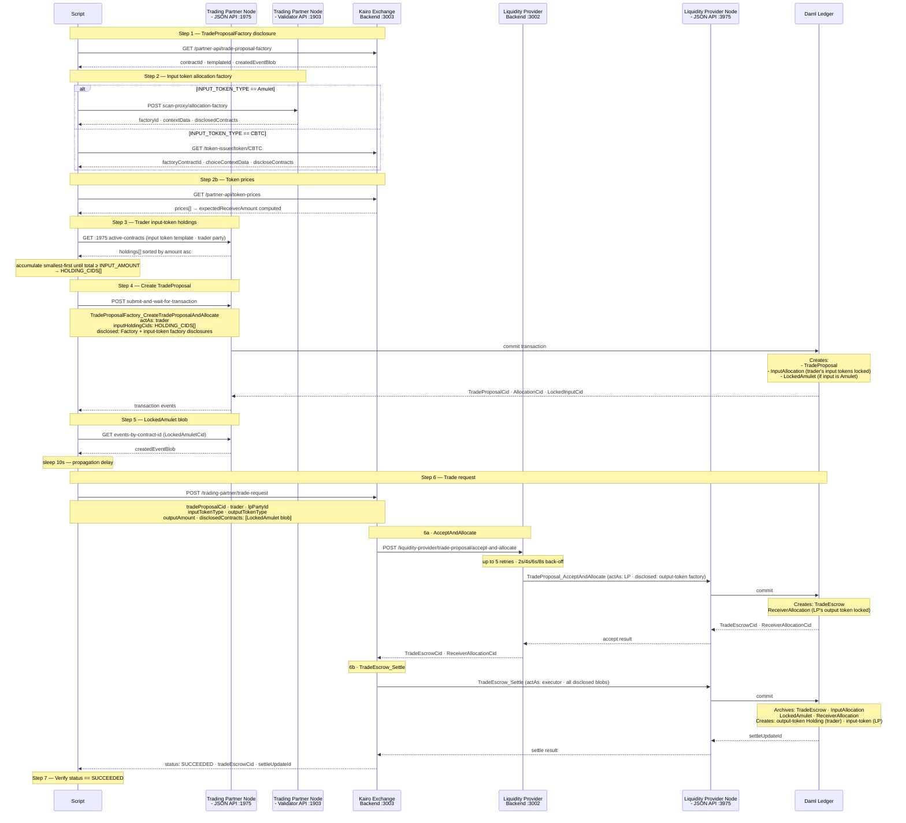
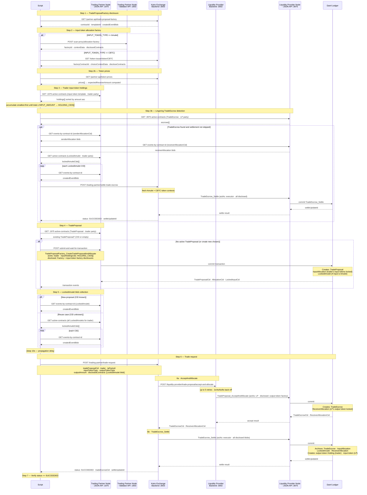
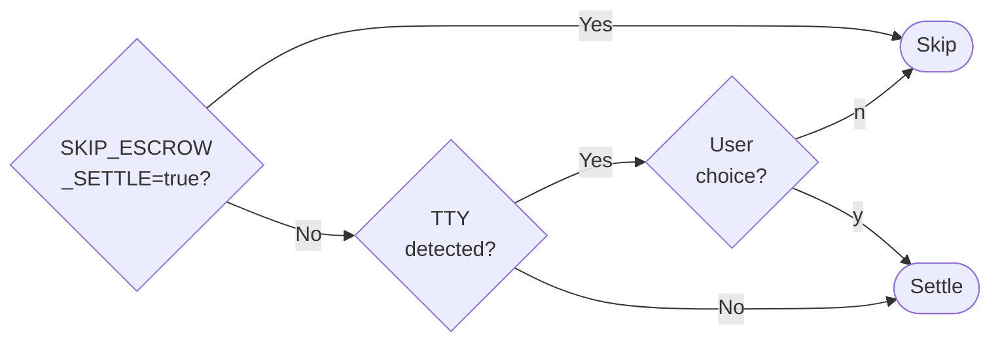
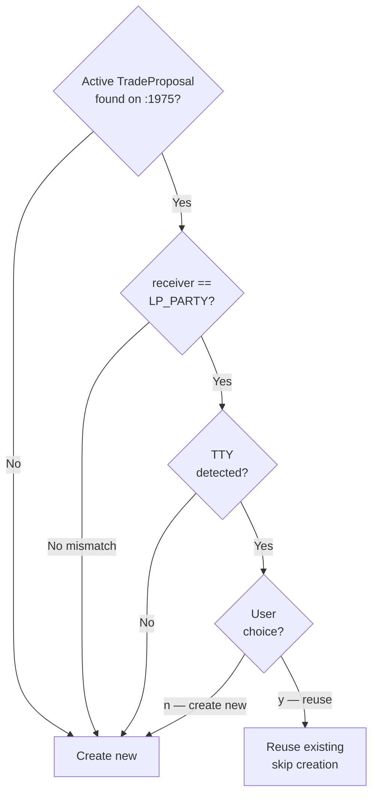
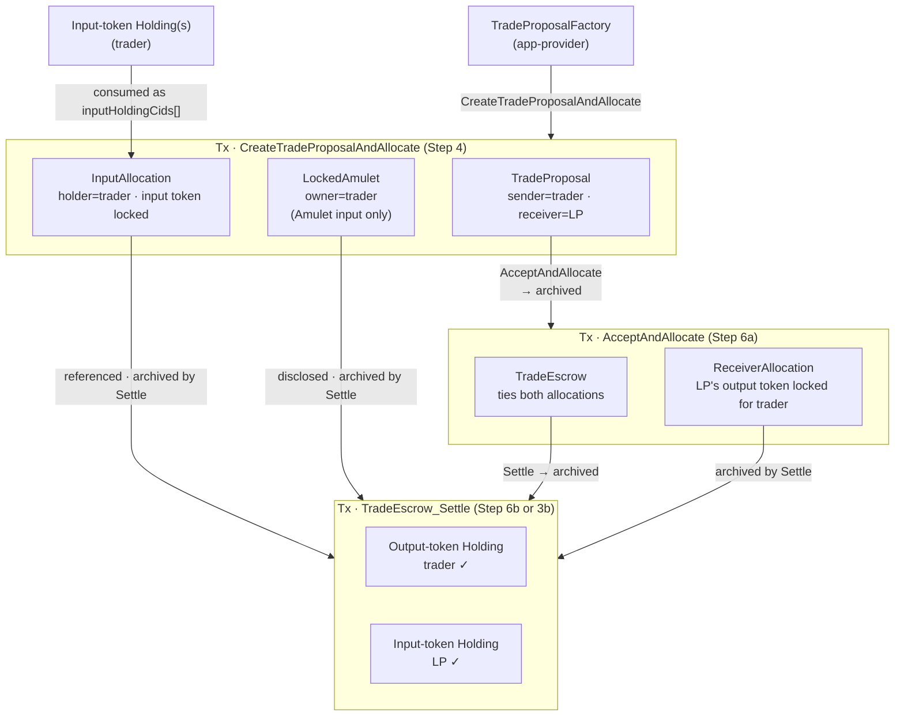
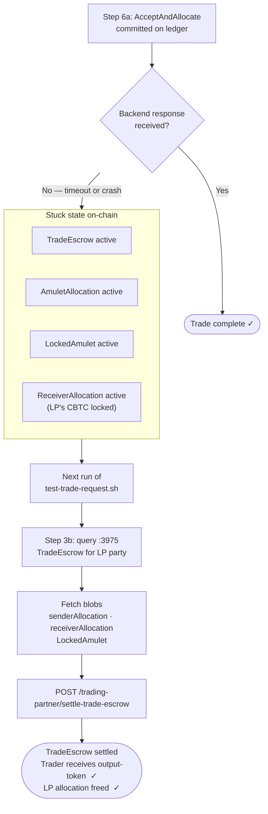

# test-trade-request.sh — Execution Flow

End-to-end flow for `POST /trading-partner/trade-request`. The script simulates a trading partner submitting a swap request (Amulet → CBTC or CBTC → Amulet) against the Kairo exchange backend.

---

## Actors and Systems

| Actor / System | Role |
|----------------|------|
| **Script** | Orchestrator — drives the entire flow |
| **Trading-partner node** (`:1975`) | Canton JSON API for the trader's participant |
| **App-provider node** (`:3975`) | Canton JSON API for the LP's participant |
| **Validator API** (`:1903`) | Scan-proxy for Amulet factory + context (Amulet input only) |
| **Exchange backend** (`:3003`) | Kairo REST API — `AcceptAndAllocate` + `Settle` |
| **Daml ledger** | Canton synchronizer — settles all contract operations |

---

## High-Level Flowchart

```mermaid
flowchart TD
    START([Start]) --> CONFIG["Config load<br>source .env + setup-exchange/.env<br>resolve parties, API key"]

    CONFIG --> S1["Step 1 · Fetch TradeProposalFactory<br>GET /partner-api/trade-proposal-factory<br>→ FACTORY_CID + FACTORY_DISCLOSED"]
    S1 --> S2_CHECK{"INPUT_TOKEN<br>_TYPE?"}
    S2_CHECK -->|Amulet| S2A["Step 2 · Fetch Amulet allocation factory<br>POST :1903/scan-proxy/allocation-factory<br>→ INPUT_FACTORY_CID + INPUT_CONTEXT_DATA"]
    S2_CHECK -->|CBTC| S2B_API["Step 2 · Fetch CBTC allocation factory<br>GET /token-issuer/token/CBTC<br>→ INPUT_FACTORY_CID + INPUT_CONTEXT_DATA"]
    S2A    --> S2B["Step 2b · Fetch token prices<br>GET /partner-api/token-prices<br>→ EXPECTED_RECEIVER_AMOUNT"]
    S2B_API --> S2B
    S2B    --> S3["Step 3 · Query trader input-token holdings<br>GET :1975 active-contracts<br>sort by amount asc · accumulate until total ≥ INPUT_AMOUNT<br>→ HOLDING_CIDS[]"]

    S3 --> S3B_Q["Step 3b · Query TradeEscrow on AP node<br>GET :3975 active-contracts LP party"]
    S3B_Q --> FOUND{"TradeEscrow<br>found?"}

    FOUND -->|No| S4_CHECK
    FOUND -->|Yes| SKIP{"SKIP_ESCROW<br>_SETTLE=true?"}

    SKIP -->|Yes| S4_CHECK
    SKIP -->|No| TTY{"TTY<br>detected?"}

    TTY -->|Yes — prompt| CHOICE{"User<br>choose n?"}
    CHOICE -->|Yes skip| S4_CHECK
    CHOICE -->|No settle| SETTLE_FLOW

    TTY -->|No — auto-settle| SETTLE_FLOW

    SETTLE_FLOW["Fetch blobs<br>· senderAllocation from :1975 or :3975<br>· receiverAllocation from :3975<br>· LockedAmulet from :1975<br>POST /trading-partner/settle-trade-escrow"] --> S4_CHECK

    S4_CHECK["Step 4 · Check ACS :1975 for active TradeProposal"] --> TP_FOUND{"TradeProposal<br>found?"}

    TP_FOUND -->|No| CREATE_TP
    TP_FOUND -->|"Yes — receiver<br>mismatch"| CREATE_TP
    TP_FOUND -->|"Yes — interactive n<br>or non-interactive"| CREATE_TP
    TP_FOUND -->|"Yes — interactive y<br>reuse"| S5

    CREATE_TP["TradeProposalFactory_CreateTradeProposalAndAllocate<br>POST :1975 submit-and-wait-for-transaction<br>actAs: trader · inputHoldingCids: HOLDING_CIDS[]<br>→ TRADE_PROPOSAL_CID<br>   TRADER_ALLOCATION_CID<br>   LOCKED_AMULET_CID"] --> S5

    S5{"New<br>proposal?"} -->|"Yes — CID known"| S5_EXACT["GET :1975 events-by-contract-id<br>for LOCKED_AMULET_CID<br>→ LOCKED_AMULET_BLOBS"]
    S5 -->|"No — reuse<br>CID unknown"| S5_ACS["GET :1975 active-contracts<br>all LockedAmulets for trader<br>fetch each blob<br>→ LOCKED_AMULET_BLOBS"]

    S5_EXACT --> SLEEP
    S5_ACS   --> SLEEP

    SLEEP["sleep 10s<br>wait for TradeProposal<br>to propagate to :3975"]

    SLEEP --> S6["Step 6 · POST /trading-partner/trade-request<br>{tradeProposalCid, trader, lpPartyId,<br>inputTokenType, outputTokenType,<br>outputAmount, disclosedContracts}"]

    S6 --> S6A["6a · AcceptAndAllocate<br>LP backend · up to 5 retries<br>2s / 4s / 6s / 8s back-off<br>→ TradeEscrow + ReceiverAllocation"]
    S6A --> S6B["6b · TradeEscrow_Settle<br>executor on :3975<br>→ trader's CBTC Holding"]
    S6B --> S7{"status ==<br>SUCCEEDED?"}

    S7 -->|Yes| PASS([TEST PASSED ✓])
    S7 -->|No| FAIL([TEST FAILED — exit 1])
```



---

## Main Flow Sequence Diagram

Happy-path only — no lingering `TradeEscrow` settlement and no reuse of an existing `TradeProposal`.



---

## Detailed Sequence Diagram



---

## Step-by-Step Reference

### Config Load (pre-flight)

Sources two `.env` files and resolves all identities from JSON sidecar files:

| Variable | Source |
|----------|--------|
| `TRADER_PARTY_ID` / `TRADER_USER_ID` | `setup-internal-parties/internal-parties.json` |
| `LP_PARTY` | `canton-exchange-backend/.env` → `LIQUIDITY_PROVIDER_PARTY_ID` |
| `EXECUTOR_PARTY` | `canton-exchange-backend/.env` → `EXECUTOR_PARTY_ID` |
| `PARTNER_API_KEY` | `partner-api-key.json` → `.partnerApiKey.rawKey` |
| `CBTC_NETWORK_PARTY` | `setup-exchange/cbtc-factories.json` → `.cbtcNetworkParty` |
| `DSO_PARTY` | `trading-partner-config.json` → `.dsoParty` |
| `BACKEND_URL` | `setup-exchange/.env` |

---

### Step 1 — TradeProposalFactory Disclosure

**Why**: The factory contract must be disclosed to the trading-partner participant so the trader can exercise its `CreateTradeProposalAndAllocate` choice. The exchange backend manages the factory on the app-provider participant and exposes it via the partner API.

```
GET {BACKEND_URL}/partner-api/trade-proposal-factory
x-api-key: {PARTNER_API_KEY}

← { contractId, templateId, createdEventBlob, synchronizerId }
```

Stored as `FACTORY_DISCLOSED` — passed later to the submit call as a disclosed contract.

---

### Step 2 — Input Token Allocation Factory

**Why**: `TradeProposalFactory_CreateTradeProposalAndAllocate` internally calls `AllocationFactory_Allocate` on the input-token factory to lock the trader's holdings. The factory, its context, and disclosed contracts differ by token type.

**When `INPUT_TOKEN_TYPE=Amulet`** — fetch from the validator scan-proxy:

```
POST {TRADING_PARTNER_VALIDATOR_API}/api/validator/v0/scan-proxy/registry/
     allocation-instruction/v1/allocation-factory
Body: { choiceArguments: {}, excludeDebugFields: true }

← {
    factoryId: "...",                     // ExternalPartyAmuletRules CID
    choiceContext: {
      choiceContextData: {                // extraArgs.context for Amulet choices
        values: {
          "amulet-rules":  { tag: "AV_ContractId", value: "..." },
          "open-round":    { tag: "AV_ContractId", value: "..." }
        }
      },
      disclosedContracts: [               // AmuletRules, OpenMiningRound, ExternalPartyAmuletRules blobs
        { contractId, templateId, createdEventBlob, synchronizerId },
        ...
      ]
    }
  }
```

**When `INPUT_TOKEN_TYPE=CBTC`** — fetch from the exchange backend token-issuer API (no auth required):

```
GET {BACKEND_URL}/token-issuer/token/CBTC

← {
    data: {
      factoryContractId: "...",           // AllocationFactory CID
      choiceContextData: {                // extraArgs.context for CBTC choices
        values: {
          "utility.digitalasset.com/instrument-configuration": { tag: "AV_ContractId", value: "..." },
          "utility.digitalasset.com/transfer-rule":            { tag: "AV_ContractId", value: "..." },
          ...
        }
      },
      discloseContracts: [                // AllocationFactory, InstrumentConfiguration, TransferRule blobs
        { contractId, templateId, createdEventBlob, synchronizerId },
        ...
      ],
      admin: "CBTC-NETWORK::1220..."      // Used for instrumentId.admin
    }
  }
```

The `OUTPUT_INSTRUMENT_ID` is also resolved here: `{id: "Amulet", admin: DSO_PARTY}` or `{id: "CBTC", admin: CBTC_NETWORK_PARTY}`.

---

### Step 2b — Token Price Calculation

Fetches live prices to compute `expectedReceiverAmount`:

```
expectedReceiverAmount = INPUT_AMOUNT × (inputTokenPrice / outputTokenPrice)
```

If the endpoint is unavailable (Chainlink not configured on localnet), falls back to `EXPECTED_RECEIVER_AMOUNT` from `trade-request-config.json` or env var. Exits with an error if no value can be determined.

---

### Step 3 — Trader's Input-Token Holdings

Queries the trading-partner ACS for active holdings of the input token owned by the trader. Holdings are sorted by amount ascending (smallest first) and accumulated until their total meets or exceeds `INPUT_AMOUNT`. This consolidates small UTXOs preferentially, reducing active contract count over time.

**Template used per token type**:

| `INPUT_TOKEN_TYPE` | Template ID | Amount field path |
|--------------------|-------------|-------------------|
| `Amulet` | `#splice-amulet:Splice.Amulet:Amulet` | `.createArgument.amount.initialAmount` |
| `CBTC` | `#utility-registry-holding-v0:Utility.Registry.Holding.V0.Holding:Holding` | `.createArgument.amount` |

```
POST :1975/v2/state/active-contracts
filtersByParty: {
  trader: { cumulative: [{ TemplateFilter: "<input-token-template>", includeCreatedEventBlob: true }] }
}
activeAtOffset: ledger-end

← holdings[] (all active, sorted by amount asc)
   → accumulate smallest-first until sum ≥ INPUT_AMOUNT
   → HOLDING_CIDS[]  (array of one or more contract IDs)
```

Exits with an error if no holdings are found or if total available < `INPUT_AMOUNT`.

---

### Step 3b — Lingering TradeEscrow Detection & Settlement

**Why this step exists**: If a previous run's `AcceptAndAllocate` succeeded but `Settle` failed (e.g., backend timeout), a `TradeEscrow` remains on-chain with the LP's output token allocation locked. A new trade cannot proceed cleanly until the escrow is settled or expires.

```
POST :3975/v2/state/active-contracts
filtersByParty: { LP_PARTY: { cumulative: [{ TemplateFilter: "TradeEscrow", includeCreatedEventBlob: false }] } }

← escrows[]
```

For each escrow found, the script reads:

| Field | Meaning |
|-------|---------|
| `sender` | Trader party (Amulet side) |
| `receiver` | LP party (CBTC side) |
| `senderAllocationCid` | Trader's locked `AmuletAllocation` |
| `receiverAllocationCid` | LP's locked `Holding` (CBTC) |
| `tradeReferenceId` | Unique trade identifier |

**Settlement decision logic**:



**Settlement call**:

```
POST {BACKEND_URL}/trading-partner/settle-trade-escrow
x-api-key: {PARTNER_API_KEY}
{
  tradeEscrowCid,
  trader,
  lpPartyId,
  inputTokenType,
  outputTokenType,
  disclosedContracts: [
    senderAllocation blob  (from :1975, fallback :3975)
    receiverAllocation blob (from :3975)
    LockedAmulet blob(s)   (from :1975 ACS scan)
  ]
}

← { status: "SUCCEEDED", settleUpdateId }
```

The exchange backend fetches Amulet and CBTC token contexts internally, then submits `TradeEscrow_Settle` via the executor party.

---

### Step 4 — TradeProposal Creation (or Reuse)

**Check for existing proposal first**:

```
POST :1975/v2/state/active-contracts
filtersByParty: { trader: { cumulative: [{ TemplateFilter: "TradeProposal", includeCreatedEventBlob: true }] } }
```

Decision tree:



**Create new — exercises `TradeProposalFactory_CreateTradeProposalAndAllocate`**:

```
POST :1975/v2/commands/submit-and-wait-for-transaction
{
  commands: [{
    ExerciseCommand: {
      templateId: TradeProposalFactory,
      contractId: FACTORY_CID,
      choice: "TradeProposalFactory_CreateTradeProposalAndAllocate",
      choiceArgument: {
        sender: trader,
        receiver: LP_PARTY,
        executor: EXECUTOR_PARTY,
        allocationArgs: {
          executor, amount,
          instrumentId: INPUT_INSTRUMENT_ID,      // {id:"Amulet",admin:DSO} or {id:"CBTC",admin:CBTC_NETWORK}
          allocationFactoryCid: INPUT_FACTORY_CID,
          inputHoldingCids: HOLDING_CIDS,          // array of one or more holding CIDs
          allocateBefore: { microseconds: 600_000_000 },   // 10 min
          settleBefore:   { microseconds: 900_000_000 },   // 15 min
          extraArgs: { context: INPUT_CONTEXT_DATA }
        },
        expectedReceiverAmount,
        expectedReceiverInstrumentId: OUTPUT_INSTRUMENT_ID  // {id:"CBTC",admin:CBTC_NETWORK} or {id:"Amulet",admin:DSO}
      }
    }
  }],
  actAs: [trader],
  disclosedContracts: [TradeProposalFactory blob, ...INPUT_FACTORY_DISCLOSED]
}
```

**Contracts created in this transaction**:

| Contract | Template | Owner/Party |
|----------|----------|-------------|
| `TradeProposal` | `Kairo.Escrow.TradeProposal` | sender=trader, receiver=LP |
| `InputAllocation` | `Splice.Api.Token.AllocationV1:Allocation` | holder=trader, input token locked |
| `LockedAmulet` | `Splice.Amulet:LockedAmulet` | owner=trader (Amulet input only) |

---

### Step 5 — LockedAmulet Blob Collection

The `LockedAmulet` must be disclosed to the executor during `TradeEscrow_Settle` because it lives only on the trading-partner participant. The `/v2/state/active-contracts` endpoint does **not** return `createdEventBlob`; `/v2/events/events-by-contract-id` must be used instead.

```
POST :1975/v2/events/events-by-contract-id
{ contractId: LOCKED_AMULET_CID,
  eventFormat: { filtersForAnyParty: { WildcardFilter: { includeCreatedEventBlob: true } } } }

← { created: { createdEvent: { contractId, templateId, createdEventBlob }, synchronizerId } }
```

When reusing a previous proposal (CID unknown), all active `LockedAmulet` contracts for the trader are fetched and their blobs collected — the settle will use the correct one automatically.

---

### Step 6 — Trade Request (AcceptAndAllocate + Settle)

A 10-second sleep precedes this call to give the Canton synchronizer time to propagate the `TradeProposal` from the trading-partner participant to the app-provider participant.

```
POST {BACKEND_URL}/trading-partner/trade-request
x-api-key: {PARTNER_API_KEY}
{
  tradeProposalCid,
  trader,
  inputAmount,
  inputTokenType,   // "Amulet" or "CBTC"
  outputTokenType,  // "CBTC" or "Amulet"
  outputAmount: expectedReceiverAmount,
  lpPartyId: LP_PARTY,
  disclosedContracts: [LockedAmulet blob(s)]
}
```

**Inside the exchange backend — 6a: AcceptAndAllocate**

Delegated to the LP backend via `POST /liquidity-provider/trade-proposal/accept-and-allocate`:

- Selects unlocked output-token holdings from the LP's ACS
- Exercises `TradeProposal_AcceptAndAllocate` on the app-provider participant
- Retries up to **5 times** with back-off delays (2 s, 4 s, 6 s, 8 s) to handle propagation lag
- On `INACTIVE_CONTRACTS` error: attempts recovery by searching for an active `TradeEscrow` with the matching `tradeReferenceId`

Contracts created:

| Contract | Template | Notes |
|----------|----------|-------|
| `TradeEscrow` | `Kairo.Escrow.TradeEscrow` | Ties the two allocations together |
| `ReceiverAllocation` | utility Holding (locked) | LP's CBTC locked for trader |

**Inside the exchange backend — 6b: Settle**

Exercises `TradeEscrow_Settle` on the app-provider participant:

```
ExerciseCommand:
  templateId: TradeEscrow
  contractId: tradeEscrowCid
  choice: TradeEscrow_Settle
  choiceArgument: {
    senderExtraArgs:   { context: inputTokenContextData },   // for input-token unlock
    receiverExtraArgs: { context: outputTokenContextData }   // for output-token transfer
  }
actAs:  [executor]
readAs: [executor, trader, LP]
disclosedContracts: [
  Input-token context disclosures   (e.g. AmuletRules + OpenMiningRound for Amulet,
                                          InstrumentConfiguration + AllocationFactory for CBTC)
  Output-token context disclosures  (e.g. InstrumentConfiguration + AllocationFactory for CBTC,
                                          AmuletRules + OpenMiningRound for Amulet)
  LP disclosed contracts            (ReceiverAllocation blob from accept tx)
  Partner disclosed contracts       (LockedAmulet blob from script)
]
```

Contracts archived and created during settle:

| Before | After |
|--------|-------|
| `TradeEscrow` (archived) | trader receives output-token `Holding` |
| `InputAllocation` (archived) | LP receives input-token `Holding` (or `Amulet`) |
| `LockedAmulet` (archived, Amulet input only) | |
| `ReceiverAllocation` (archived) | |

---

### Step 7 — Verification

Checks `status == "SUCCEEDED"` in the response. On failure, provides actionable hints:

| Error pattern | Hint |
|---------------|------|
| `No unlocked holdings` / `available balance` | Fund the LP with `06-fund-liquidity-provider.sh`; withdraw the locked Amulet with `03-withdraw-allocation.sh` |
| `Could not fetch TradeProposal` | Increase propagation delay or re-run (proposal is still active) |
| `TradeProposal expired` / `allocateBefore` | Withdraw locked Amulet with `03-withdraw-allocation.sh`, then retry |

---

## Contract Lifecycle



---

## Error Recovery Path



---

## Environment Variables Quick Reference

| Variable | Default | Description |
|----------|---------|-------------|
| `TRADING_PARTNER_JSON_API` | `http://localhost:1975` | Trading-partner Canton JSON API |
| `APP_PROVIDER_JSON_API` | `http://localhost:3975` | App-provider Canton JSON API |
| `TRADING_PARTNER_VALIDATOR_API` | `http://localhost:1903` | Validator API (scan-proxy) |
| `INPUT_AMOUNT` | `10` | Amulet amount to swap |
| `INPUT_TOKEN_TYPE` | `Amulet` | Input token |
| `OUTPUT_TOKEN_TYPE` | `CBTC` | Output token |
| `EXPECTED_RECEIVER_AMOUNT` | _(calculated)_ | Override computed output amount |
| `TRADER_PARTY_ID` | from `internal-parties.json` | Fully qualified trader party ID |
| `TRADER_USER_ID` | from `internal-parties.json` | Trader's Canton user ID |
| `PARTNER_API_KEY` | from `partner-api-key.json` | Exchange backend `x-api-key` |
| `SKIP_ESCROW_SETTLE` | _(unset)_ | Set `true` to skip step 3b settlement |
