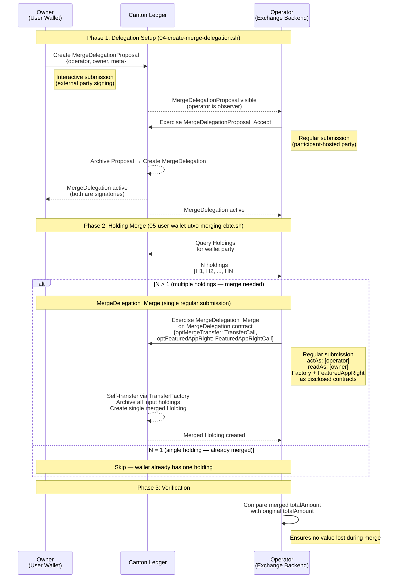

# UTXO Handling Scripts

Scripts for generating user wallets with CBTC token holdings and setting up merge delegations on the local Canton Network Quickstart. These simulate UTXO-like token distribution for testing exchange operations such as holding merges and airdrops.

## Scripts Overview

| Script | Purpose | Run Order |
|--------|---------|-----------|
| `01-generate-user-wallet.sh` | Generate 25 external-party wallets and onboard them | 1st |
| `02-request-minting-cbtc.sh` | Mint CBTC token holdings for each wallet | 2nd |
| `03-request-faucet-amulet.sh` | Faucet Amulet (CC) token holdings for each wallet | 3rd |
| `04-create-merge-delegation.sh` | Create MergeDelegation contracts for each user wallet | 4th |
| `05-user-wallet-utxo-merging-cbtc.sh` | Merge all CBTC holdings per wallet into a single holding | 5th |
| `06-user-wallet-utxo-merging-amulet.sh` | Merge all Amulet holdings per wallet into a single holding | 6th |
| `07-query-holdings-cbtc.sh` | Query current CBTC holdings from the ledger | 7th |
| `08-query-holdings-amulet.sh` | Query current Amulet holdings from the ledger | 8th |
| `09-merge-holdings-cbtc.sh` | Merge CBTC holdings using pre-queried JSON input | 9th |
| `10-merge-holdings-amulet.sh` | Merge Amulet holdings using pre-queried JSON input | 10th |

## Quick Start

```bash
# Ensure quickstart is running and setup-exchange scripts have completed
# (01-setup-exchange.sh, 02-register-featured-app-right.sh, 03-register-cbtc-token.sh)

# 1. Generate user wallets (keypairs + external party onboarding)
./01-generate-user-wallet.sh

# 2. Mint CBTC token holdings for each wallet
./02-request-minting-cbtc.sh

# 3. Faucet Amulet (CC) token holdings for each wallet
./03-request-faucet-amulet.sh

# 4. Create MergeDelegation contracts for each wallet
./04-create-merge-delegation.sh

# 5. Merge all CBTC holdings into single holdings per wallet
./05-user-wallet-utxo-merging-cbtc.sh

# 6. Merge all Amulet holdings into single holdings per wallet
./06-user-wallet-utxo-merging-amulet.sh

# --- Alternative: Query-then-Merge workflow (scripts 07-10) ---
# Instead of scripts 05/06 (which query + merge in one step),
# you can split into separate query and merge phases:

# 7. Query current CBTC holdings from the ledger
./07-query-holdings-cbtc.sh

# 8. Query current Amulet holdings from the ledger
./08-query-holdings-amulet.sh

# 9. Merge CBTC holdings (reads from 07's JSON output)
./09-merge-holdings-cbtc.sh

# 10. Merge Amulet holdings (reads from 08's JSON output)
./10-merge-holdings-amulet.sh
```

## Prerequisites

1. **Quickstart running** with all services healthy:

   ```bash
   cd quickstart && make start
   ```

2. **Setup-exchange completed** -- all three scripts must have been run:
   - `01-setup-exchange.sh` (DARs uploaded, contracts created, backend DB migrated)
   - `02-register-featured-app-right.sh` (FeaturedAppRight registered)
   - `03-register-cbtc-token.sh` (CBTC-NETWORK external party onboarded, AllocationFactory + token issuer registered)

3. **Canton Exchange Backend running**:

   ```bash
   cd /path/to/canton-exchange-backend && yarn start:dev
   ```

4. **Configuration files present** in `../setup-exchange/`:
   - `.env` -- shared environment configuration (sourced by all scripts)
   - `cbtc-config.json` -- CBTC token parameters
   - `cbtc-network-keypair.json` -- CBTC-NETWORK party keypair (generated by `03-register-cbtc-token.sh`)
   - `cbtc-factories.json` -- Factory contract IDs and disclosures (generated by `03-register-cbtc-token.sh`)
   - `featured-app-right.json` -- FeaturedAppRight contract ID and disclosure (generated by `02-register-featured-app-right.sh`)

5. **Tools**: `curl`, `jq`, `openssl`, `node` (with `@canton-network/core-signing-lib` installed in the exchange backend)

---

## Script 1: `01-generate-user-wallet.sh`

Generates user wallet external parties with random multicultural names (European, Chinese, Vietnamese) and onboards them on the app-user participant. Each wallet gets a shared party hint (default `kairo`, customizable via `PARTY_HINT`), a unique display name, and a generated Gmail email address.

### Usage

```bash
./01-generate-user-wallet.sh

# With custom number of wallets
NUM_WALLETS=5 ./01-generate-user-wallet.sh

# With custom party hint
PARTY_HINT=myapp ./01-generate-user-wallet.sh
```

### Configuration

Configurable via environment variables:

| Variable | Default | Description |
|----------|---------|-------------|
| `NUM_WALLETS` | `25` | Number of user wallets to generate |
| `PARTY_HINT` | `kairo` | Party hint used for all external parties on the ledger |

### What It Does

| Step | Action | Details |
|------|--------|---------|
| 0 | Pre-flight | Sources `../setup-exchange/.env`, loads CBTC config and keypair, generates Canton JWT, gets synchronizer ID |
| -- | Cleanup | Removes downstream JSON files from previous runs (`user-wallet-holdings-*.json`, `user-wallet-merge-delegation.json`, `user-wallet-merged-holdings-*.json`) |
| 1 | Generate keypairs | Creates Ed25519 keypairs with random multicultural names (European, Chinese, Vietnamese) in a single Node.js invocation using `@canton-network/core-signing-lib`. All wallets share the same `partyHint` (from `PARTY_HINT` env var); each gets a unique `displayName` and `email`. Saves to `user-wallet-keypairs.json` |
| 2 | Onboard external parties | For each wallet: `generate-topology` -> sign multiHash -> `allocate`. Updates keypairs file with resolved party IDs |
| 3 | Create Canton users | Creates Canton users with `CanActAs`/`CanReadAs` rights. Also grants admin user rights over each wallet party |

### Idempotency

- Keypairs are regenerated with fresh random names on every run (existing file is deleted automatically).
- External party allocation checks if each party exists before allocating.
- Canton user creation checks via `GET /v2/users/{userId}` before creating.

### Output Files

| File | Description |
|------|-------------|
| `user-wallet-keypairs.json` | Object with top-level `partyHint` and `wallets` array containing wallet entries |

#### `user-wallet-keypairs.json` format

```json
{
  "partyHint": "kairo",
  "wallets": [
    {
      "index": 0,
      "displayName": "Emma Mueller",
      "email": "emma.mueller.x3kQ2@gmail.com",
      "userId": "emma-mueller",
      "partyId": "kairo::1220...",
      "publicKey": "base64...",
      "privateKey": "base64...",
      "fingerprint": "1220..."
    }
  ]
}
```

---

## Script 2: `02-request-minting-cbtc.sh`

Mints CBTC token holdings for each user wallet using the utility package's `AllocationFactory`. Creates multiple holdings per wallet to simulate UTXO-like token distribution.

### Usage

```bash
# Requires: 01-generate-user-wallet.sh + setup-exchange 03-register-cbtc-token.sh completed
./02-request-minting-cbtc.sh

# With custom settings
MINTS_PER_WALLET=5 MIN_AMOUNT=50 MAX_AMOUNT=500 ./02-request-minting-cbtc.sh
```

### Configuration

Configurable via `utxo-handling/.env` or environment variables:

| Variable | Default | Description |
|----------|---------|-------------|
| `MINTS_PER_WALLET` | `20` | Number of CBTC mint requests per wallet |
| `MIN_AMOUNT` | `100` | Minimum CBTC amount per holding |
| `MAX_AMOUNT` | `1000` | Maximum CBTC amount per holding |

### What It Does

| Step | Action | Details |
|------|--------|---------|
| 0 | Pre-flight | Sources configs, loads CBTC-NETWORK keypair + AllocationFactory + InstrumentConfiguration from `cbtc-factories.json`, generates JWT, gets synchronizer |
| 1 | Request mints | For each wallet, creates 20 `MintRequest` contracts by exercising `AllocationFactory_RequestMint` via **interactive submission** (wallet signs). Random amounts between 100-1000 CBTC |
| 2 | Accept mints | CBTC-NETWORK accepts all 500 mint requests by exercising `MintRequest_Accept` via **interactive submission**, creating `Holding` contracts |
| 3 | Write report | Writes `user-wallet-holdings-cbtc.json` with per-wallet holdings (contract IDs, amounts, totals) |

### Daml Minting Flow

The minting follows the `AllocationFactory_RequestMint` / `MintRequest_Accept` pattern from the utility package:

1. **Wallet (holder, external party)** exercises `AllocationFactory_RequestMint` on the `AllocationFactory` contract:
   - Template: `#utility-registry-app-v0:Utility.Registry.App.V0.Service.AllocationFactory:AllocationFactory`
   - Arguments: `instrumentId: { admin: CBTC_NETWORK, id: "CBTC" }`, `amount`, `holder`, `reference`, timestamps
   - ExtraArgs: `instrument-configuration` (CID) + empty `issuer-credentials`
   - AllocationFactory + InstrumentConfiguration passed as **disclosed contracts**
   - Creates a `MintRequest` contract

2. **CBTC-NETWORK (registrar, external party)** exercises `MintRequest_Accept`:
   - Template: `#utility-registry-app-v0:Utility.Registry.App.V0.Model.Mint:MintRequest`
   - No disclosed contracts needed (registrar is signatory)
   - Creates a `Holding` + `ExecutedMint`

Both parties are external, so both steps use **interactive submission** (prepare -> sign -> execute).

### Idempotency

**Mint requests and holdings are NOT idempotent** -- re-running the script will create additional holdings. To start fresh, delete the output file and re-run `01-generate-user-wallet.sh` first (which cleans up downstream JSON files).

### Output Files

| File | Description |
|------|-------------|
| `user-wallet-holdings-cbtc.json` | Holdings report with per-wallet `holdings[]` (contractId, amount) and `totalAmount` |

#### `user-wallet-holdings-cbtc.json` format

```json
{
  "generatedAt": "2026-02-11T...",
  "partyHint": "kairo",
  "cbtcNetworkParty": "CBTC-NETWORK::1220...",
  "tokenId": "CBTC",
  "totalHoldings": 500,
  "wallets": [
    {
      "partyId": "kairo::1220...",
      "userId": "emma-mueller",
      "holdings": [
        { "contractId": "00...", "amount": 423 },
        { "contractId": "00...", "amount": 781 }
      ],
      "totalAmount": 8452
    }
  ]
}
```

---

## Script 3: `03-request-faucet-amulet.sh`

Faucets Amulet (CC) tokens for each user wallet using the DevNet `AmuletRules_DevNet_Tap` choice. Creates multiple Amulet holdings per wallet.

### Usage

```bash
# Requires: 01-generate-user-wallet.sh completed, quickstart in DevNet mode
./03-request-faucet-amulet.sh

# With custom settings
TAPS_PER_WALLET=5 MIN_AMOUNT=50 MAX_AMOUNT=500 ./03-request-faucet-amulet.sh
```

### Configuration

Configurable via `utxo-handling/.env` or environment variables:

| Variable | Default | Description |
|----------|---------|-------------|
| `TAPS_PER_WALLET` | `20` | Number of Amulet taps per wallet |
| `MIN_AMOUNT` | `100` | Minimum CC amount per holding |
| `MAX_AMOUNT` | `1000` | Maximum CC amount per holding |

### What It Does

| Step | Action | Details |
|------|--------|---------|
| 0 | Pre-flight | Sources config, generates JWTs for app-user and SV participants, gets synchronizer ID, resolves DSO party ID |
| 1 | Fetch SV contracts | Fetches `AmuletRules` + `OpenMiningRound` from SV participant with `includeCreatedEventBlob: true` for use as disclosed contracts |
| 2 | Tap Amulet | For each wallet, exercises `AmuletRules_DevNet_Tap` N times via **interactive submission** (wallet signs). Random amounts between 100-1000 CC |
| 3 | Write report | Writes `user-wallet-holdings-amulet.json` with per-wallet Amulet holdings |

### Daml Fauceting Flow

1. **Fetch disclosed contracts** from SV participant (port 4975):
   - `AmuletRules` (`#splice-amulet:Splice.AmuletRules:AmuletRules`) -- DSO is signatory
   - `OpenMiningRound` (`#splice-amulet:Splice.Round:OpenMiningRound`) -- picks the latest round

2. **Wallet (receiver, external party)** exercises `AmuletRules_DevNet_Tap`:
   - Template: `#splice-amulet:Splice.AmuletRules:AmuletRules`
   - Arguments: `receiver` (wallet party), `amount` (decimal), `openRound` (CID)
   - AmuletRules + OpenMiningRound passed as **disclosed contracts**
   - Creates an `Amulet` contract (the CC holding)

> **Note**: This choice is only available in **DevNet mode**. It does not exist on TestNet or MainNet.

### Idempotency

**Amulet taps are NOT idempotent** -- re-running the script will create additional holdings.

### Output Files

| File | Description |
|------|-------------|
| `user-wallet-holdings-amulet.json` | Holdings report with per-wallet Amulet holdings |

#### `user-wallet-holdings-amulet.json` format

```json
{
  "generatedAt": "2026-02-11T...",
  "partyHint": "kairo",
  "dsoParty": "DSO::1220...",
  "tokenId": "Amulet",
  "totalHoldings": 500,
  "wallets": [
    {
      "partyId": "kairo::1220...",
      "userId": "emma-mueller",
      "holdings": [
        { "contractId": "00...", "amount": 547 },
        { "contractId": "00...", "amount": 312 }
      ],
      "totalAmount": 11234
    }
  ]
}
```

---

## Script 4: `04-create-merge-delegation.sh`

Creates `MergeDelegation` contracts that allow the exchange backend's executor party to merge token holdings on behalf of each user wallet.

### Usage

```bash
# Requires: 01-generate-user-wallet.sh completed
./04-create-merge-delegation.sh
```

### What It Does

| Step | Action | Details |
|------|--------|---------|
| 0 | Pre-flight | Loads config, user wallet keypairs, reads `EXECUTOR_PARTY_ID` from backend `.env`, generates Canton JWT |
| 1 | Create delegations | For each wallet: (a) owner creates `MergeDelegationProposal` via interactive submission, (b) operator accepts via regular submission |
| 2 | Write report | Writes `user-wallet-merge-delegation.json` with delegation contract IDs |

### MergeDelegation Workflow

The creation follows a two-step proposal/accept pattern from `splice-util-token-standard-wallet`:

1. **Owner (user wallet, external party)** creates `MergeDelegationProposal`:
   - Template: `#splice-util-token-standard-wallet:Splice.Util.Token.Wallet.MergeDelegation:MergeDelegationProposal`
   - Arguments: `{ delegation: { operator: EXECUTOR_PARTY, owner: WALLET_PARTY, meta: { values: {} } } }`
   - Signatory: `delegation.owner`; Observer: `delegation.operator`
   - Submitted via **interactive submission** (external party requires signing)

2. **Operator (executor party)** exercises `MergeDelegationProposal_Accept`:
   - Controller: `delegation.operator`
   - Creates `MergeDelegation` with signatories `owner` and `operator`
   - Submitted via **regular submission** (`/v2/commands/submit-and-wait-for-transaction`) since the executor is a participant-hosted party

### Key Concepts

**Operator**: The `EXECUTOR_PARTY_ID` from the exchange backend's `.env` file. This is the app-user party that the backend acts as. It will later use the `MergeDelegation` contracts to merge holdings via `MergeDelegation_Merge`.

**MergeDelegation template** (`#splice-util-token-standard-wallet:Splice.Util.Token.Wallet.MergeDelegation:MergeDelegation`):

- Fields: `operator` (Party), `owner` (Party), `meta` (Metadata)
- Signatories: both `owner` and `operator`
- Key choices:
  - `MergeDelegation_Merge` -- operator merges the owner's token holdings (nonconsuming)
  - `MergeDelegation_Reject` -- operator rejects the delegation (consuming)
  - `MergeDelegation_Withdraw` -- owner withdraws the delegation (consuming)

### Output File

`user-wallet-merge-delegation.json`:

```json
{
  "generatedAt": "2026-02-11T...",
  "partyHint": "kairo",
  "operatorParty": "app_user_quickstart-...",
  "mergeDelegationTemplateId": "#splice-util-token-standard-wallet:Splice.Util.Token.Wallet.MergeDelegation:MergeDelegation",
  "totalDelegations": 25,
  "wallets": [
    {
      "partyId": "kairo::1220...",
      "userId": "emma-mueller",
      "mergeDelegationContractId": "00..."
    }
  ]
}
```

---

## MergeDelegation Smart Contract Workflow

The MergeDelegation system enables an **operator** (the exchange backend's executor party) to merge token holdings on behalf of **owners** (user wallet external parties). This section describes the Daml templates, their lifecycle, and how the scripts use them.

### Templates Overview

The workflow involves three Daml templates from `splice-util-token-standard-wallet`:

| Template | Signatories | Purpose |
|----------|-------------|---------|
| `MergeDelegationProposal` | `owner` | Proposal to delegate merge authority to an operator |
| `MergeDelegation` | `owner`, `operator` | Active delegation granting the operator merge rights |
| `BatchMergeUtility` | `operator` | Utility for batch-processing multiple merge delegations |

### Template Fields

**MergeDelegationProposal**:

- `delegation` — nested record containing `operator` (Party), `owner` (Party), `meta` (Metadata)
- Signatory: `delegation.owner`
- Observer: `delegation.operator`

**MergeDelegation**:

- `operator` (Party) — the party authorized to merge holdings
- `owner` (Party) — the party whose holdings can be merged
- `meta` (Metadata) — arbitrary metadata (`{ values: {} }`)
- Signatories: both `operator` and `owner`

**BatchMergeUtility**:

- `operator` (Party) — the batch processor
- `changeHoldings` (Map InstrumentId ContractId) — tracks change holdings between merge calls
- Signatory: `operator`

### Choices

**MergeDelegationProposal** choices:

| Choice | Controller | Effect |
|--------|-----------|--------|
| `MergeDelegationProposal_Accept` | `delegation.operator` | Consumes proposal, creates `MergeDelegation` |
| `MergeDelegationProposal_Reject` | `delegation.operator` | Consumes proposal (rejects) |
| `MergeDelegationProposal_Withdraw` | `delegation.owner` | Consumes proposal (owner withdraws) |

**MergeDelegation** choices:

| Choice | Controller | Consuming | Effect |
|--------|-----------|-----------|--------|
| `MergeDelegation_Merge` | `operator` | No | Merges owner's holdings via a TransferFactory self-transfer |
| `MergeDelegation_Reject` | `operator` | Yes | Operator terminates the delegation |
| `MergeDelegation_Withdraw` | `owner` | Yes | Owner revokes the delegation |

**MergeDelegation_Merge** parameters:

- `optMergeTransfer` (Optional TransferCall) — the TransferFactory call for the self-transfer merge:
  - `factoryCid` (ContractId TransferFactory) — the factory contract ID
  - `choiceArg` (TransferFactory_Transfer) — transfer arguments (sender, receiver, amount, inputHoldingCids, etc.)
- `optExtraTransfer` (Optional TransferCall) — optional second factory call (not used by these scripts)
- `optFeaturedAppRight` (Optional FeaturedAppRightCall) — optional FeaturedAppRight for app reward tracking:
  - `appRightCid` (ContractId FeaturedAppRight) — the FeaturedAppRight contract ID
  - `beneficiaries` ([AppRewardBeneficiary]) — list of beneficiary parties with weights

### Lifecycle Sequence Diagram



### How MergeDelegation_Merge Works

The `MergeDelegation_Merge` choice executes a self-transfer through a `TransferFactory`, merging multiple holdings into one in a single atomic transaction. The operator (exchange backend's executor party) submits the command via **regular submission** with `actAs: [operator]` and `readAs: [owner]` — no wallet private keys are needed.

Both the **utility** `AllocationFactory` (CBTC) and **Amulet** `ExternalPartyAmuletRules` return `TransferInstructionResult_Completed` for **self-transfers** (sender == receiver), which is exactly what `MergeDelegation_Merge` performs. This means the merge completes atomically in a single transaction.

The factory contract and `FeaturedAppRight` (for app reward tracking) are passed as **disclosed contracts** in the submission.

> **Note**: The utility `AllocationFactory` is a single contract that implements multiple Splice token standard interfaces: `AllocationFactory` (minting), `TransferFactory` (transfers), and `BurnMintFactory` (burn/mint). When `MergeDelegation_Merge` exercises `TransferFactory_Transfer`, it is exercising an interface choice on the `AllocationFactory` contract — there is no separate `TransferFactory` contract.

### BatchMergeUtility (Advanced)

For production use cases with many wallets and multiple token types, the `BatchMergeUtility` template provides batch processing:

1. **Operator creates** `BatchMergeUtility` with initial `changeHoldings` map
2. **Exercise `BatchMergeUtility_Call`** for each `MergeDelegation` — processes one owner's merge and threads the updated `changeHoldings` to the next call
3. **Exercise `BatchMergeUtility_Close`** when done — archives the utility and returns final change holdings

This pattern is optimized for batch-processing many wallets in sequence. These scripts use individual `MergeDelegation_Merge` calls per wallet instead, which is simpler for the script-based workflow.

---

## Script 5: `05-user-wallet-utxo-merging-cbtc.sh`

Merges all CBTC token holdings for each user wallet into a single holding per wallet using `MergeDelegation_Merge`, then verifies that balances are preserved.

### Usage

```bash
# Requires: 02-request-minting-cbtc.sh + 04-create-merge-delegation.sh completed
./05-user-wallet-utxo-merging-cbtc.sh

# Merge only the first 5 wallets
NUM_WALLETS=5 ./05-user-wallet-utxo-merging-cbtc.sh
```

### What It Does

| Step | Action | Details |
|------|--------|---------|
| 0 | Pre-flight | Loads config, keypairs, delegation data, original holdings; generates JWT; loads AllocationFactory from `cbtc-factories.json` and FeaturedAppRight from `featured-app-right.json` |
| 1 | Merge holdings | For each wallet: queries holdings, exercises `MergeDelegation_Merge` via regular submission (operator submits, no wallet signing needed) |
| 2 | Write report | Writes `user-wallet-merged-holdings-cbtc.json` with one holding per wallet |
| 3 | Verify balances | Compares merged totals with original `user-wallet-holdings-cbtc.json` totals |

### MergeDelegation_Merge Flow (CBTC)

The merge uses `MergeDelegation_Merge` which internally exercises `TransferFactory_Transfer` as a self-transfer through the `AllocationFactory`. For each wallet with multiple holdings:

1. **Operator exercises `MergeDelegation_Merge`** on the wallet's `MergeDelegation` contract:
   - `actAs: [OPERATOR_PARTY]`, `readAs: [WALLET_PARTY]`
   - `optMergeTransfer.factoryCid`: AllocationFactory contract ID
   - `optMergeTransfer.choiceArg`: `TransferFactory_Transfer` with sender=receiver=wallet, all holding CIDs as inputs, total amount
   - `optFeaturedAppRight`: FeaturedAppRight contract ID + beneficiary (operator party)
   - **Disclosed contracts**: AllocationFactory + InstrumentConfiguration + FeaturedAppRight
   - Submitted via **regular submission** — no wallet private keys needed
   - Self-transfer returns `Completed`, merging all holdings atomically

> **Note**: The `AllocationFactory` is a single contract implementing three Splice token standard interfaces: `AllocationFactory` (minting), `TransferFactory` (transfers), and `BurnMintFactory` (burn/mint). There is no separate `TransferFactory` contract — the interface choice is exercised directly on the `AllocationFactory` contract.

### Merge Idempotency

- Wallets with a single holding are skipped (already merged).
- **Merging is NOT idempotent** — re-running on already-merged wallets will skip them (single holding), but if the script fails mid-way, some wallets may have been merged while others have not.

### Merged Output File

`user-wallet-merged-holdings-cbtc.json`:

```json
{
  "generatedAt": "2026-02-11T...",
  "partyHint": "kairo",
  "cbtcNetworkParty": "CBTC-NETWORK::1220...",
  "tokenId": "CBTC",
  "totalHoldings": 25,
  "wallets": [
    {
      "partyId": "kairo::1220...",
      "userId": "emma-mueller",
      "holdings": [
        { "contractId": "00...", "amount": 8452 }
      ],
      "totalAmount": 8452
    }
  ]
}
```

### Balance Verification

After merging, the script compares each wallet's `totalAmount` in `user-wallet-merged-holdings-cbtc.json` with the corresponding `totalAmount` in `user-wallet-holdings-cbtc.json`. Any mismatch is reported as an error. The verification handles decimal vs integer comparison (ledger amounts may include `.0` suffix).

---

## Script 6: `06-user-wallet-utxo-merging-amulet.sh`

Merges all Amulet (CC) holdings for each user wallet into a single Amulet per wallet using `MergeDelegation_Merge`, then verifies that balances are preserved.

### Usage

```bash
# Requires: 03-request-faucet-amulet.sh + 04-create-merge-delegation.sh completed
./06-user-wallet-utxo-merging-amulet.sh

# Merge only the first 5 wallets
NUM_WALLETS=5 ./06-user-wallet-utxo-merging-amulet.sh
```

### What It Does

| Step | Action | Details |
|------|--------|---------|
| 0 | Pre-flight | Loads config, keypairs, delegation data, original holdings; generates JWTs for app-user and SV; resolves DSO party; loads FeaturedAppRight from `featured-app-right.json` |
| 1 | Fetch SV contracts | Fetches `ExternalPartyAmuletRules` + `AmuletRules` + `OpenMiningRound` from SV participant with blobs for use as disclosed contracts (3 contracts total) |
| 2 | Merge holdings | For each wallet: queries Amulet holdings, exercises `MergeDelegation_Merge` via regular submission (operator submits, no wallet signing needed) |
| 3 | Write report | Writes `user-wallet-merged-holdings-amulet.json` with one Amulet per wallet |
| 4 | Verify balances | Compares merged totals with original `user-wallet-holdings-amulet.json` totals |

### MergeDelegation_Merge Flow (Amulet)

The merge uses `MergeDelegation_Merge` which internally exercises `TransferFactory_Transfer` as a self-transfer through the `ExternalPartyAmuletRules`. For each wallet with multiple holdings:

1. **Operator exercises `MergeDelegation_Merge`** on the wallet's `MergeDelegation` contract:
   - `actAs: [OPERATOR_PARTY]`, `readAs: [WALLET_PARTY]`
   - `optMergeTransfer.factoryCid`: ExternalPartyAmuletRules contract ID
   - `optMergeTransfer.choiceArg`: `TransferFactory_Transfer` with sender=receiver=wallet, all Amulet CIDs as inputs, total amount
   - ExtraArgs context: `amulet-rules` (CID) + `open-round` (CID)
   - `optFeaturedAppRight`: FeaturedAppRight contract ID + beneficiary (operator party)
   - **Disclosed contracts**: ExternalPartyAmuletRules + AmuletRules + OpenMiningRound + FeaturedAppRight (4 total)
   - Submitted via **regular submission** — no wallet private keys needed
   - Self-transfer returns `Completed`, merging all holdings atomically

> **Note**: Like the CBTC `AllocationFactory`, the `ExternalPartyAmuletRules` is a single contract implementing multiple Splice token standard interfaces including `TransferFactory` and `AllocationFactory`. The `TransferFactory_Transfer` interface choice is exercised directly on the `ExternalPartyAmuletRules` contract.

### Differences from CBTC Merging (Script 5)

| Aspect | CBTC (Script 5) | Amulet (Script 6) |
|--------|-----------------|-------------------|
| Factory contract | `AllocationFactory` (from `cbtc-factories.json`) | `ExternalPartyAmuletRules` (fetched live from SV) |
| Disclosed contracts | 3 (AllocationFactory + InstrumentConfiguration + FeaturedAppRight) | 4 (ExternalPartyAmuletRules + AmuletRules + OpenMiningRound + FeaturedAppRight) |
| ExtraArgs context | `instrument-configuration` + credentials | `amulet-rules` + `open-round` |
| Amount field | `createArgument.amount` | `createArgument.amount.initialAmount` (ExpiringAmount) |
| Admin party | CBTC-NETWORK | DSO |

### Balance Verification

After merging, the script compares each wallet's `totalAmount` in `user-wallet-merged-holdings-amulet.json` with the corresponding `totalAmount` in `user-wallet-holdings-amulet.json`. Small differences may occur for Amulet tokens due to holding fees (ExpiringAmount).

### Merged Output File

`user-wallet-merged-holdings-amulet.json`:

```json
{
  "generatedAt": "2026-02-11T...",
  "partyHint": "kairo",
  "dsoParty": "DSO::1220...",
  "tokenId": "Amulet",
  "totalHoldings": 25,
  "wallets": [
    {
      "partyId": "kairo::1220...",
      "userId": "emma-mueller",
      "holdings": [
        { "contractId": "00...", "amount": 11234 }
      ],
      "totalAmount": 11234
    }
  ]
}
```

---

## Scripts 07-10: Query-then-Merge Workflow

Scripts 05 and 06 query holdings **live** from the ledger and merge them in a single run. Scripts 07-10 split this into separate phases:

1. **Query phase** (07, 08): Query current holdings from the ledger and write them to JSON files.
2. **Merge phase** (09, 10): Read holdings from the JSON files and merge them.

This separation is useful when you want to inspect or modify the holdings data between querying and merging, or when re-running merges after a partial failure without re-querying the ledger.

### Prerequisites

Scripts 07-10 require:

- `01-generate-user-wallet.sh` completed (keypairs exist)
- `04-create-merge-delegation.sh` completed (MergeDelegation contracts exist) -- for scripts 09/10
- Holdings exist on the ledger (from scripts 02/03 or previous operations)
- `cbtc-factories.json` present in `../setup-exchange/` -- for script 09
- `featured-app-right.json` present in `../setup-exchange/` -- for scripts 09/10

---

## Script 7: `07-query-holdings-cbtc.sh`

Queries all active CBTC `Holding` contracts for each user wallet from the ledger and writes a JSON report.

### Usage

```bash
# Requires: 01-generate-user-wallet.sh + holdings exist on ledger
./07-query-holdings-cbtc.sh
```

### Configuration

| Variable | Source | Description |
|----------|--------|-------------|
| `NUM_WALLETS` | `user-wallet-keypairs.json` | Automatically determined from keypairs file |

No configurable parameters — the script processes all wallets found in the keypairs file.

### What It Does

| Step | Action | Details |
|------|--------|---------|
| 0 | Pre-flight | Sources `../setup-exchange/.env`, loads CBTC config + CBTC-NETWORK keypair, generates JWT |
| 1 | Query holdings | For each wallet: queries active contracts matching the `Holding` template, extracts contract IDs and amounts |
| 2 | Write report | Writes `user-wallet-holdings-cbtc.json` with per-wallet holdings and totals |

### Ledger Query Details

- **Template**: `#utility-registry-holding-v0:Utility.Registry.Holding.V0.Holding:Holding`
- **Endpoint**: `GET /v2/state/active-contracts` on the app-user JSON API (port 2975)
- **Amount field**: `createArgument.amount` (string, e.g. `"267.0000000000"`)
- Queries use `verbose: true` and `includeCreatedEventBlob: false`

### Output Files

| File | Description |
|------|-------------|
| `user-wallet-holdings-cbtc.json` | Per-wallet CBTC holdings with contract IDs, amounts, and totals |

#### `user-wallet-holdings-cbtc.json` format

```json
{
  "generatedAt": "2026-02-11T...",
  "partyHint": "kairo",
  "cbtcNetworkParty": "CBTC-NETWORK::1220...",
  "tokenId": "CBTC",
  "templateId": "#utility-registry-holding-v0:Utility.Registry.Holding.V0.Holding:Holding",
  "totalHoldings": 500,
  "wallets": [
    {
      "partyId": "kairo::1220...",
      "userId": "emma-mueller",
      "holdings": [
        { "contractId": "00...", "amount": 423 },
        { "contractId": "00...", "amount": 781 }
      ],
      "totalAmount": 8452
    }
  ]
}
```

---

## Script 8: `08-query-holdings-amulet.sh`

Queries all active Amulet (CC) contracts for each user wallet from the ledger and writes a JSON report.

### Usage

```bash
# Requires: 01-generate-user-wallet.sh + holdings exist on ledger (DevNet mode)
./08-query-holdings-amulet.sh
```

### Configuration

| Variable | Source | Description |
|----------|--------|-------------|
| `NUM_WALLETS` | `user-wallet-keypairs.json` | Automatically determined from keypairs file |

No configurable parameters — the script processes all wallets found in the keypairs file.

### What It Does

| Step | Action | Details |
|------|--------|---------|
| 0 | Pre-flight | Sources `../setup-exchange/.env`, generates JWT, resolves DSO party ID via scan-proxy |
| 1 | Query holdings | For each wallet: queries active contracts matching the `Amulet` template, extracts contract IDs and amounts |
| 2 | Write report | Writes `user-wallet-holdings-amulet.json` with per-wallet holdings and totals |

### Ledger Query Details

- **Template**: `#splice-amulet:Splice.Amulet:Amulet`
- **Endpoint**: `GET /v2/state/active-contracts` on the app-user JSON API (port 2975)
- **Amount field**: `createArgument.amount.initialAmount` (Amulet uses `ExpiringAmount` — the amount is nested under `.amount.initialAmount`, not a flat `.amount`)
- Queries use `verbose: true` and `includeCreatedEventBlob: false`

### Output Files

| File | Description |
|------|-------------|
| `user-wallet-holdings-amulet.json` | Per-wallet Amulet holdings with contract IDs, amounts, and totals |

#### `user-wallet-holdings-amulet.json` format

```json
{
  "generatedAt": "2026-02-11T...",
  "partyHint": "kairo",
  "dsoParty": "DSO::1220...",
  "tokenId": "Amulet",
  "templateId": "#splice-amulet:Splice.Amulet:Amulet",
  "totalHoldings": 500,
  "wallets": [
    {
      "partyId": "kairo::1220...",
      "userId": "emma-mueller",
      "holdings": [
        { "contractId": "00...", "amount": 547 },
        { "contractId": "00...", "amount": 312 }
      ],
      "totalAmount": 11234
    }
  ]
}
```

---

## Script 9: `09-merge-holdings-cbtc.sh`

Merges CBTC holdings for each user wallet using pre-queried JSON input (from script 07). Same `MergeDelegation_Merge` logic as script 05, but reads holdings from a JSON file instead of querying the ledger live.

### Usage

```bash
# Requires: 07-query-holdings-cbtc.sh + 04-create-merge-delegation.sh completed
./09-merge-holdings-cbtc.sh
```

### Configuration

| Variable | Source | Description |
|----------|--------|-------------|
| `NUM_WALLETS` | `user-wallet-keypairs.json` | Automatically determined from keypairs file |

### What It Does

| Step | Action | Details |
|------|--------|---------|
| 0 | Pre-flight | Sources configs, loads AllocationFactory + InstrumentConfiguration from `cbtc-factories.json`, loads FeaturedAppRight from `featured-app-right.json`, generates JWT |
| 1 | Merge holdings | For each wallet: reads holdings from `user-wallet-holdings-cbtc.json`, exercises `MergeDelegation_Merge` via regular submission |
| 2 | Write report | Writes `user-wallet-merged-holdings-cbtc.json` with one holding per wallet |
| 3 | Verify balances | Compares merged totals with original JSON input totals (integer comparison) |

### Key Difference from Script 05

| Aspect | Script 05 (live query) | Script 09 (JSON input) |
|--------|------------------------|------------------------|
| Holdings source | Queries ledger live per wallet | Reads from `user-wallet-holdings-cbtc.json` (script 07 output) |
| Prerequisite | Holdings on ledger | `07-query-holdings-cbtc.sh` run |
| Re-run behavior | Always gets latest holdings | Uses snapshot from last query |

The merge mechanism is identical: `MergeDelegation_Merge` on the `MergeDelegation` contract, using `AllocationFactory` as the transfer factory via regular submission.

### Input Files

| File | Produced by | Description |
|------|-------------|-------------|
| `user-wallet-holdings-cbtc.json` | Script 07 | Per-wallet CBTC holdings (contract IDs and amounts) |
| `cbtc-factories.json` | `setup-exchange/03-register-cbtc-token.sh` | AllocationFactory + InstrumentConfiguration contract IDs and disclosures |
| `featured-app-right.json` | `setup-exchange/02-register-featured-app-right.sh` | FeaturedAppRight contract ID and disclosure |
| `user-wallet-merge-delegation.json` | Script 04 | MergeDelegation contract IDs |

### Output Files

| File | Description |
|------|-------------|
| `user-wallet-merged-holdings-cbtc.json` | One merged holding per wallet with contract ID and total amount |

### Balance Verification

After merging, the script compares each wallet's `totalAmount` in the merged output with the corresponding `totalAmount` in the input JSON. Comparison uses integer truncation to handle decimal formatting differences (e.g. `1151` vs `1151.0000000000`).

---

## Script 10: `10-merge-holdings-amulet.sh`

Merges Amulet (CC) holdings for each user wallet using pre-queried JSON input (from script 08). Same `MergeDelegation_Merge` logic as script 06, but reads holdings from a JSON file instead of querying the ledger live.

### Usage

```bash
# Requires: 08-query-holdings-amulet.sh + 04-create-merge-delegation.sh completed
./10-merge-holdings-amulet.sh
```

### Configuration

| Variable | Source | Description |
|----------|--------|-------------|
| `NUM_WALLETS` | `user-wallet-keypairs.json` | Automatically determined from keypairs file |

### What It Does

| Step | Action | Details |
|------|--------|---------|
| 0 | Pre-flight | Sources configs, generates JWTs for app-user and SV, resolves DSO party, loads FeaturedAppRight from `featured-app-right.json` |
| 1 | Fetch SV contracts | Fetches `ExternalPartyAmuletRules` + `AmuletRules` + `OpenMiningRound` from SV participant with blobs for use as disclosed contracts (3 contracts total) |
| 2 | Merge holdings | For each wallet: reads holdings from `user-wallet-holdings-amulet.json`, exercises `MergeDelegation_Merge` via regular submission |
| 3 | Write report | Writes `user-wallet-merged-holdings-amulet.json` with one Amulet per wallet |
| 4 | Verify balances | Compares merged totals with original JSON input totals (integer comparison) |

### Key Difference from Script 06

| Aspect | Script 06 (live query) | Script 10 (JSON input) |
|--------|------------------------|------------------------|
| Holdings source | Queries ledger live per wallet | Reads from `user-wallet-holdings-amulet.json` (script 08 output) |
| SV contracts | Fetched live (same) | Fetched live (same) |
| Prerequisite | Holdings on ledger | `08-query-holdings-amulet.sh` run |
| Re-run behavior | Always gets latest holdings | Uses snapshot from last query |

The merge mechanism is identical to script 06: `MergeDelegation_Merge` on the `MergeDelegation` contract, using `ExternalPartyAmuletRules` as the transfer factory via regular submission. SV contracts are always fetched live since they may change between rounds.

### Input Files

| File | Produced by | Description |
|------|-------------|-------------|
| `user-wallet-holdings-amulet.json` | Script 08 | Per-wallet Amulet holdings (contract IDs and amounts) |
| `featured-app-right.json` | `setup-exchange/02-register-featured-app-right.sh` | FeaturedAppRight contract ID and disclosure |
| `user-wallet-merge-delegation.json` | Script 04 | MergeDelegation contract IDs |

### Output Files

| File | Description |
|------|-------------|
| `user-wallet-merged-holdings-amulet.json` | One merged Amulet per wallet with contract ID and total amount |

### Balance Verification

After merging, the script compares each wallet's `totalAmount` in the merged output with the corresponding `totalAmount` in the input JSON. Small differences may occur for Amulet tokens due to holding fees (`ExpiringAmount`).

---

## Shared Patterns

### External Party Onboarding

External parties (not hosted by any participant) use a three-step onboarding flow:

1. **Generate topology** (`POST /v2/parties/external/generate-topology`): Provide public key, party hint, and synchronizer. Returns topology transactions and a `multiHash`.
2. **Sign multiHash**: Sign with the party's Ed25519 private key via `@canton-network/core-signing-lib`.
3. **Allocate** (`POST /v2/parties/external/allocate`): Submit signed topology. Returns the allocated `partyId` (format: `hint::fingerprint`).

### Interactive Submission

External parties cannot use standard `submit-and-wait`. They use the interactive submission protocol:

1. **Prepare** (`POST /v2/interactive-submission/prepare`): Sends the command, returns `preparedTransaction` and `preparedTransactionHash`.
2. **Sign**: Sign the prepared transaction hash with the external party's Ed25519 private key.
3. **Execute** (`POST /v2/interactive-submission/executeAndWaitForTransaction`): Submit the signed transaction. Returns the committed transaction with events.

### Regular Submission

Participant-hosted parties (like the executor) use standard command submission:

- **Endpoint**: `POST /v2/commands/submit-and-wait-for-transaction`
- **Body format**: Commands must be wrapped in `{ "commands": { ... } }`
- No external signing required; the participant handles authorization.

### Ed25519 Keypair Format

All scripts use NaCl/TweetNaCl format Ed25519 keypairs generated by `@canton-network/core-signing-lib`:

- **Public key**: 32 bytes, base64-encoded
- **Private key**: 64 bytes (seed + public key), base64-encoded
- **Canton fingerprint**: `1220` + SHA256(uint32BE(12) + publicKeyBytes) as hex

---

## Troubleshooting

**"CBTC config not found" or "CBTC-NETWORK keypair not found"**: Run `03-register-cbtc-token.sh` in `../setup-exchange/` first. It generates `cbtc-config.json` and `cbtc-network-keypair.json`.

**Keypair generation fails**: Ensure `@canton-network/core-signing-lib` is installed in the exchange backend directory (`yarn install` or `npm install`).

**External party allocation fails**: The Canton participant must support external parties (Canton 3.4.10+). Verify the quickstart is fully up with `docker ps`.

**Interactive submission fails with "INVALID_ARGUMENT"**: The external party's public key may not match the one registered during topology generation. If you regenerated keys, delete `user-wallet-keypairs.json` and re-run.

**MergeDelegation proposal creation fails with "PACKAGE_NOT_FOUND"**: The `splice-util-token-standard-wallet` package may not be uploaded to the participant. This package is normally available as part of the Splice infrastructure. Verify by checking uploaded packages:

```bash
curl -s http://localhost:2975/v2/packages -H "Authorization: Bearer <token>" | jq '.packageIds | length'
```

**"EXECUTOR_PARTY_ID not found"**: Run `01-setup-exchange.sh` first to generate the backend `.env` file with resolved party IDs.

**Re-running after failure**: Steps 1-3 of `01-generate-user-wallet.sh` are idempotent (keypairs, parties, users). However, Steps 4-5 (minting) are NOT idempotent. If the script fails partway through minting, you may need to clean up manually or start fresh by deleting the output files and re-running.

**Script takes too long**: Generating 500 mint requests and 500 accept transactions involves 1000 interactive submissions. Each requires a prepare-sign-execute round trip. Expect the minting scripts to take several minutes depending on network latency. Merge scripts (05/06/09/10) are faster since they use regular submission via `MergeDelegation_Merge` (no signing round-trips).
